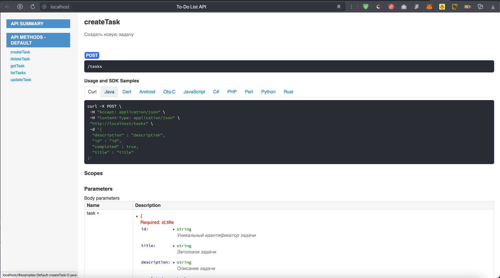

University: [ITMO University](https://itmo.ru/ru/)  
Faculty: [FICT](https://fict.itmo.ru)  
Course: [Application containerization and orchestration](https://github.com/itmo-ict-faculty/application-containerization-and-orchestration)  
Year: 2023/2024  
Group: K4112c  
Author: Tasmaev Igor Aleksandrovich
Practice: practice 1  
Date of create: 13.05.2024  
Date of finished: 14.05.2024

Цель: изучить практическое применение технологии контейнеризации при разработке микросервисных приложений

Ход работы:

1. Написан сервис to-do list, который умеет получать, добавлять, удалять и обновлять задачи

2. Написан докерфайл для сервиса

    ```dockerfile
    FROM gradle:8.6.0-jdk17 as builder
    WORKDIR /src
    COPY . .
    RUN gradle assemble
    
    FROM openjdk:17-jdk
    WORKDIR /app
    COPY --from=builder /src/build/libs/to-do-list-1.0.0.jar /app/app.jar
    ENTRYPOINT ["java", "-jar", "app.jar"]
    ```

3. Сервис запущен в контейнере, после чего осуществлена проверка работы приложения.

   ```bash
   curl localhost/tasks
   []

   curl localhost/tasks -H "Content-Type:application/json" --data '{"id": "11", "title": "test"}'
   {"id": "11", "title": "test"}

   curl localhost/tasks
   [{"id": "11", "title": "test"}]
   ```

Вывод: в ходе выполнения практической работы был написан сервис to-do list, а также создан Dockerfile для него.