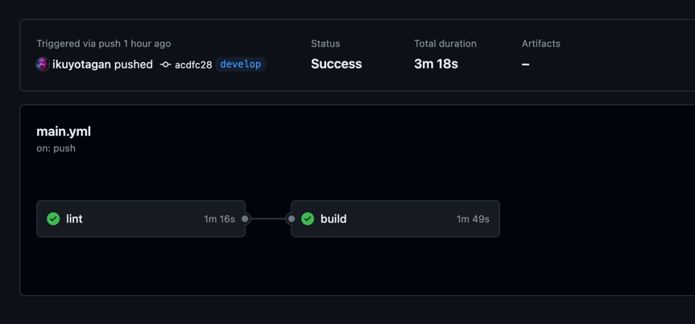

University: [ITMO University](https://itmo.ru/ru/)  
Faculty: [FICT](https://fict.itmo.ru)  
Course: [Application containerization and orchestration](https://github.com/itmo-ict-faculty/application-containerization-and-orchestration)  
Year: 2023/2024  
Group: K4112c  
Author: Tasmaev Igor Aleksandrovich
Practice: practice 3  
Date of create: 13.05.2024  
Date of finished: 14.05.2024

Цель: установка и настройка специальных инструментов, которые помогут автоматизировать процесс тестирования и развертывания программного обеспечения

Ход работы:

Выбран GitFlow в GitHub Actions.

Для реализации GitFlow pipeline в GitHub Actions, который будет выполнять проверку кода Kotlin с использованием Linter через Gradle, сборку кода в Docker контейнер, пуш в Docker Hub и отправку уведомлений на почту, создан YAML файл в каталоге .github/workflows репозитория.

Для успешного использования модели GitFlow в репозитории GitHub, репозиторий настроен так, чтобы он поддерживал несколько ключевых веток, а также установлены стратегии для слияния и управления релизами. 
GitFlow разделяет рабочий процесс на несколько основных веток: main, develop, feature/*, release/*, и hotfix/*.

```yaml
name: Kotlin CI/CD Pipeline

on:
  push:
    branches:
      - main
      - develop
      - 'feature/**'
      - 'release/**'
      - 'hotfix/**'

jobs:
  lint:
    runs-on: ubuntu-latest

    steps:
      # Шаг 1: Проверка кода
      - name: Checkout code
        uses: actions/checkout@v4

      - name: Set up JDK 17
        uses: actions/setup-java@v4
        with:
          java-version: '17'
          distribution: 'adopt'

      - name: Lint Kotlin code
        run: ./gradlew ktlintCheck

  build:
    runs-on: ubuntu-latest
    needs:
      - lint

    steps:
      # Шаг 2: Сборка Docker образа и пуш в Docker Hub
      - name: Checkout code
        uses: actions/checkout@v4

      - name: Build Docker image
        run: docker build -t ikuyotagan/to-do-list:$GITHUB_SHA -f docker/Dockerfile .

      - name: Log in to DockerHub
        uses: docker/login-action@v3
        with:
          username: ${{ secrets.DOCKER_USERNAME }}
          password: ${{ secrets.DOCKER_PASSWORD }}

      - name: Push Docker image to DockerHub
        run: docker push ikuyotagan/to-do-list:$GITHUB_SHA
```



Вывод: в ходе выполнения практической работы была выьрана схема GitFlow, а также платформа GitHub Actions, после чего был написан пайплайн, реализующий проверку кода и сборку образов, с последующим пушем их в dockerhub.